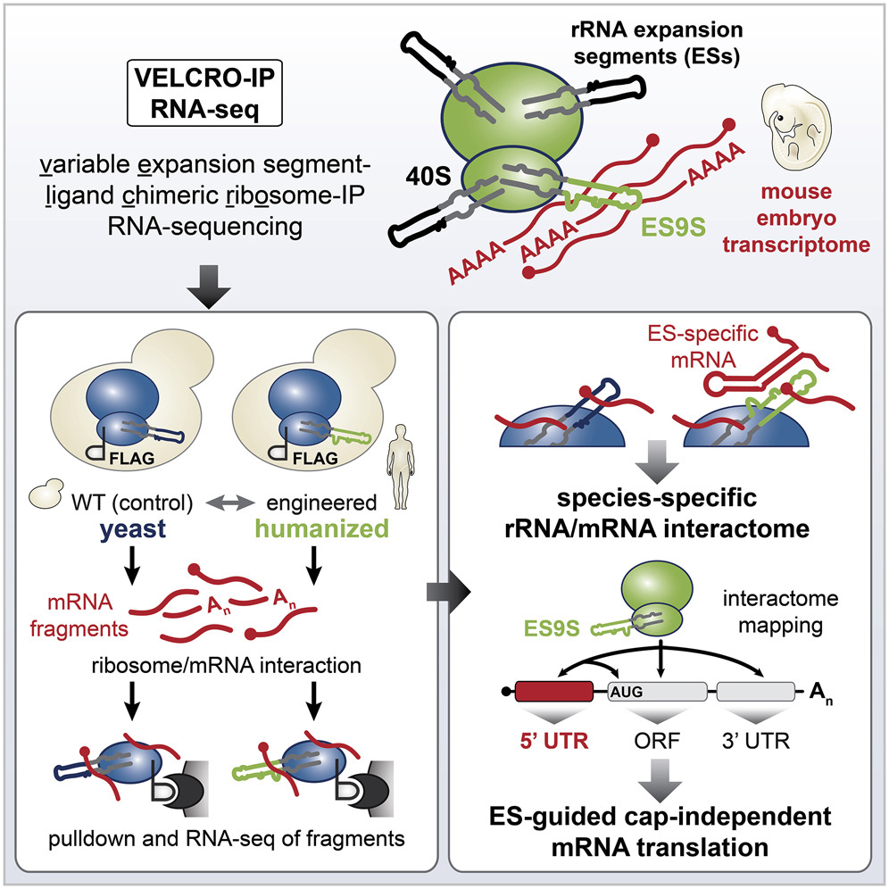

This repository provides the data processing pipeline and analysis codes used in:

Leppek K, Byeon GW, Fujii K, Barna M. VELCRO-IP RNA-seq reveals ribosome expansion segment function in translation genome-wide.

```bibtex
@article{https://doi.org/10.1016/j.celrep.2020.108629},
  title={VELCRO-IP RNA-seq reveals ribosome expansion segment function in translation genome-wide},
  author={Kathrin Leppek, Gun Woo Byeon, Kotaro Fujii, Maria Barna},
  journal={Cell Reports},
  year={2021}
}
```




### Description
* Raw sequencing data files are available in GEO: GSE141382
* velcroip.R reproduces analysis and plots in the paper
